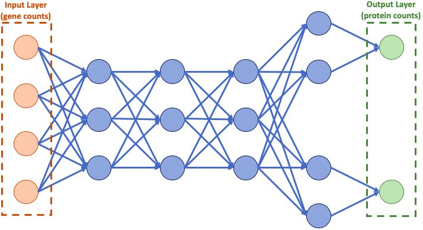

```{r setup, include=FALSE}
library(knitr)
knitr::opts_chunk$set(echo = TRUE)
knitr::opts_chunk$set(tidy.opts=list(width.cutoff=60),tidy=TRUE)
```

Here we will be doing a quick foray into deep learning using the 10X genomics data published in June 2019. This data tracks around 230,000 cells across 4 different donors. For each cell, the data specify gene expression data, protein expression data, and antigen specificity data.

Broadly, our goal is to create a machine learning approach to predict protein expression from gene expression data. This model, if it is effective, could be useful for predicting cell type, imputing sparse protein counts, or transferring to different scRNA-seq data sets to generate new protein information. 

We have a lot of data here to work with, but it is not obvious how best to approach building the model. I decided to use a basic neural net, as they have shown excellent performance recently in transcriptomic problems, and are ideal for predicting complex nonlinear functions such as protein values. Other options include decision forests and linear regression, both of which might work here and have relative benefits such as simplicity and readability.

Please note that several hyperparameters have been adjusted to help the vignette run quickly. I will mark these spots with more optimal values.

I will be using BioConductor/SingleCellExperiment to store and process the data, before feeding it into the Keras interface to TensorFlow to build the actual neural network. I will mostly show the best setup I have found, with notes explaining how I tested and made decisions. With that said, let's dive into the problem.

## Cut up the data

We will begin with processing and subsetting of the data, to get it into a form that can be fed into Keras. In this vignette, I work only with the last of the four donors, and therefore only have access to around 36000 cells.

```{r reading, results = 'hide', message = FALSE}
library(DropletUtils)
library(BiocManager)
library(SingleCellExperiment)
SCE <- read10xCounts("../10Xdata/vdj_v1_hs_aggregated_donor4_filtered_feature_bc_matrix.h5")

trainingSize = 10000 # how many cells to train on (this affects speed linearly.. 30000 is optimal)
testingSize = 5000 # how many cells to test on (this does not affect speed much.. 5000 is plenty)

# grab the first cells as training cells, and then the next cells as testing cells
geneTrainingSCE <- SCE[,1:trainingSize]
geneTestingSCE <- SCE[,(trainingSize+1):(trainingSize+testingSize)]

# this GREP captures the proteins we are interested in from the SCE. Note that this does not include the IgG suite of proteins (these are controls)
proteinList <- grep("CD.*|HLA-DR", rowData(geneTrainingSCE)$ID)
getProteinMatrix <- function(x) { # from an SCE, gets the transposed matrix of proteins
  x[proteinList] %>%
    counts() %>%
    as.matrix() %>%
    t() %>%
    clr() # we perform a centered log ratio transform to normalize the counts
}

# tensorflow breaks if fed dashes, so we replace dashes in the protein names with underscores
fixProteinColNames <- function(x) {
  colnames(x)[colnames(x) == "CD279_PD-1"] <- "CD279_PD_1"
  colnames(x)[colnames(x) == "HLA-DR"] <- "HLA_DR"
  x
}

library(purrr)
library(compositions)
proteinTrainingData <- geneTrainingSCE %>%
  getProteinMatrix() %>%
  fixProteinColNames()
proteinTestingData <- geneTestingSCE %>%
  getProteinMatrix() %>%
  fixProteinColNames()

geneTrainingSCE <- geneTrainingSCE[rowData(geneTrainingSCE)$Type == "Gene Expression"]
geneTestingSCE <- geneTestingSCE[rowData(geneTestingSCE)$Type == "Gene Expression"]
```

## Cleaning the data
Now we will clean and prepare the data to be used in the model. We use some basic techniques like filtering out poorly-expressed genes and normalizing the GEX matrix.

```{r clean, results = 'hide', message = FALSE, warning = FALSE}
# just like for the proteins, we need to turn the delayed matrices to matrices
counts(geneTrainingSCE) <- as.matrix(counts(geneTrainingSCE))
counts(geneTestingSCE) <- as.matrix(counts(geneTestingSCE))

# keep genes with at least 1 read in at least 5% of cells (remove low frequency genes) 
min_reads <- 1
min_cells <- 0.05 * ncol(geneTrainingSCE) 
# calculate a boolean vector for which genes to keep
keep <- rowSums(counts(geneTrainingSCE) >= min_reads) >= min_cells
# subset both SCEs using this vector
geneTrainingSCE <- geneTrainingSCE[keep, ]
geneTestingSCE <- geneTestingSCE[keep, ]

# for readability, swap rownames from row ID to row symbol
library(scater)
featureNames <- uniquifyFeatureNames(ID = rowData(geneTrainingSCE)$ID, names = rowData(geneTrainingSCE)$Symbol)
rownames(geneTrainingSCE) <- featureNames
rownames(geneTestingSCE) <- featureNames

# normalize
geneTrainingSCE <- scater::normalize(geneTrainingSCE)
geneTestingSCE <- scater::normalize(geneTestingSCE)
```

## Select Data

Here is where we decide which genes and proteins to train on. I decided to train the model on only the more highly variable genes. Hopefully this reduces noise in the model and makes it easier and faster for the model to train. I also decided to remove CD127 from the list of proteins to predict, as the actual values for it are mostly 0. 

```{r selectData, results = 'hide', message = FALSE}
# find highly variable genes
library(scran)
fit <- trendVar(geneTrainingSCE, use.spikes = FALSE)
dec <- decomposeVar(geneTrainingSCE, fit)
hvg <- dec$bio > 0 # get biologically relevant genes

getGeneMatrix <- function(x) {
  # subset both SCE's with that set of genes
  x[hvg,] %>%
  logcounts() %>%
  t()
}

trainingData <- getGeneMatrix(geneTrainingSCE)
testingData <- getGeneMatrix(geneTestingSCE)

# choose output protein(s)
# CD127 has almost no expression
select <- c(TRUE, TRUE, TRUE, TRUE, TRUE, TRUE, TRUE, TRUE, FALSE, TRUE, TRUE)
#  1: CD3, 2: CD19, 3: CD45RA, 4: CD4, 5: CD8a, 6: CD14, 7: CD45RO, 8: CD279_PD_1, 9: CD127, 10: CD197_CCR7, 11: HLA_DR

trainingLabels <- proteinTrainingData[,select]
testingLabels <- proteinTestingData[,select]

```

## Building the model

I tried many iterations of the model's hyperparameters, and found some with decent performance on a few important proteins. Here is a compilation of what I know about these hyperparameters, and what they do. This list is sorted with most important first.

* Dropout - Dropout is the process of choosing randomly some proportion of nodes from a layer (often the input layer) to get dropped completely. This helps ensure that the model is training using all available data, as sometimes key genes are not included. Using dropout does seem to have a large positive effect on performance. Good values seem to range from ~.2 to ~.5. 
* Learning rate - The rate at which the model changes its parameters. Values between 0.0002 and 0.001 seem to work fine.
  + If this is too high, the model will jump between local minima and potentially never converge. In the loss graph, this correlates to great variance in loss between adjacent epochs. If the model has not converged by the end of the run, it is probably losing a lot of prediction accuracy, so this is a problem
  + If this is too low, the model will simply take a long time to converge, which is not a big issue.
* Layer sizes - This is one I don't fully understand. One thing I have noticed is that too few layers in a bottleneck (less than 4?) is a bad thing. The number of nodes in a bottleneck layer represents the dimensionality through which the input space is forced. Too few, and the information carried by the bottleneck will not be enough to reconstruct important features.
* Number of layers - Again, I haven't seen much difference. I also haven't spent too much time looking. Usually ~3 is a solid number. Too many less and there is no space to approximate hard non-linear functions. Too many more and the model will have a hard time making use of the added complexity.
* Activation function - RELU is an activation function which zeros out any activation below 0, and sigmoid squishes any value asymptotically between 0 and 1. Basically the difference is that RELU destroys negative values, and sigmoid doesn't. I dabbled briefly with sigmoid activation and it ruined everything. I have been sticking to RELU. I think it does a good job of zeroing out noise in a lot of cases. I wouldn't be opposed to having a sigmoid layer here or there, but I do think the model requires 1 relu layer at a minimum. 
* Batch size - This is the number of samples that the model goes through before it decides which direction to train. Generally a power of 2, often 32, 64, or 128. Small sizes will mean the model is often pulled different directions towards different local minima, whereas large sizes will cause the model to move in the same direction. I find that 128 works nicely, but haven't played with it too much.
* Optimizer function / Loss function - I didn't test either of these, but I will include a note about them here. The optimizer function used is RMSprop



Evolution of model:

1. I started with only a couple of layers, with high dimensionality (around 64), predicting only a single protein expression. This was taking a long time to train the network with this large parameter space to train.
2. The training time went down a lot as I brought down the dimension of the layers, closer to 8 or 4. This didn't seem to affect the performance, so I kept it to keep training times down.
3. I added a dropout layer, and this vastly improved performance.
4. I added the extra proteins, which actually decreased the performance of the couple proteins I was originally looking at.

```{r buildModel, results = 'hide', message = FALSE}
library(keras)

# set the input layer to be the right dimension
inputs <- layer_input(shape = c(dim(trainingData)[2]))

# create the first FOUR layers
output0 <- inputs %>%
  # each of these lines creates a new layer, and specifies the number of nodes and the activation function
  layer_dropout(rate = .4) %>%
  layer_dense(units = 128, activation = 'relu') %>% 
  layer_dense(units = 32, activation = 'relu') %>%
  layer_dense(units = 8, activation = 'relu') %>%
  layer_dense(units = 16, activation = 'relu')

# all of the layers are shared up until the last two, during which each protein gets its own set of 8 nodes leading to 1 output
makeOutputLayer <- function(x) {
  layer_dense(output0, units=8) %>%
    layer_dense(units=1, name= colnames(trainingLabels)[x])
}

# for each protein, create the last 2 layers and add them to the original 4. See the architecture diagram
outputs <- lapply(1:dim(trainingLabels)[2], makeOutputLayer)

model <- keras_model(inputs=inputs, outputs=outputs)

model %>% compile(
  loss = "mse",
  optimizer = optimizer_rmsprop(lr = .0001), # learning rate here
  metrics = list("mean_absolute_error"),
)

model %>% summary()

# Display training progress by printing a single dot for each completed epoch.
print_dot_callback <- callback_lambda(
  on_epoch_end = function(epoch, logs) {
    if (epoch %% 50 == 0) cat("\n")
    cat(".")
  }
)    
# epochs refers to how many passes through the data we make, and affects run time linearly. we can use early stopping techniques to set this, or we can just give it a set value to reach. 50 to 100 is usually good, but here I use 25 to help it train fast.
epochs <- 40
batch_size <- 128

```

```{r trainModel, results = 'hide'}
# Train the model
history <- model %>% fit(
  x = trainingData,
  y = lapply(1:dim(trainingLabels)[2], function(x) {trainingLabels[,x]}),
  batch_size = batch_size,
  epochs = epochs,
  validation_split = 0.2,
  verbose = 0,
  callbacks = list(print_dot_callback)
)
```

```{r graph, echo = FALSE}
scatter <- function(x, y=".") {
  plot(testingLabels[,x], unlist(predict(model, testingData)[x]), xlab = paste(colnames(testingLabels)[x],"log value from data"), ylab = "Log value predicted by model", pch = y)
}

scatters <- function() {
  par(mfrow = c(2,2))
  invisible(lapply(c(3,7,8,10), scatter))
}

lossPlots <- function() {
  par(mfrow = c(2,2))
  plot(history$metrics$val_CD45RA_mean_absolute_error, xlab="epoch", ylab="CD45RA mae")
  plot(history$metrics$val_CD45RO_mean_absolute_error, xlab="epoch", ylab="CD45RO mae")
  plot(history$metrics$val_CD279_PD_1_mean_absolute_error, xlab="epoch", ylab="CD279_PD_1 mae")
  plot(history$metrics$val_CD197_CCR7_mean_absolute_error, xlab="epoch", ylab="CD8a mae") #5
}

correlations <- function(){
  predictions <- predict(model, testingData)
  total <- 0
  for (i in 1:dim(trainingLabels)[2]) {
    corr <- cor(as.numeric(unlist(predictions[i])), testingLabels[,i])
    if (!is.na(corr)){
      print(paste("The correlation between predicted and actual values for", colnames(testingLabels)[i], "is", corr))
      if (corr > 0) {
        total <- total + corr^2
      }
      else {
        total <- total - corr^2
      }
    }
  }
  print(paste("The sum of squared correlations is", total))
}
```

Here we can take a look at some interesting statistics from the model process.

First we see a set of plots that show the model's loss over time for four proteins, CD45RA, CD8a, CD45RO, and CD279_PD_1. We can clearly see that as the model trains, it becomes more effective at predicting these values.

```{r lossPlots}
lossPlots()
```

Here we can see a scatter plot showing on one axis the actual protein values for each cell, and on the other axis, the model's predicted values for those same proteins.

```{r scatters}
scatters()
```

And finally, I printed out a simple list of the correlation between the model's predictions and the actual values. As you can see, many of the proteins are not able to be predicted at all by the model.

```{r correlations}
correlations()
```

# Discussion

Overall the results are relatively good. Considering that we are predicting within a single cell type, a good fraction of the variance in the protein expression can be explained by the gene quantities. If the model contained multiple types of cells, a lot more of the variance probably could be explained, as it is easier to predict expression using cell type markers than using other genes. 

This method can easily be applied to other data sets, as it is very extensible and makes almost no assumptions. In fact, it will likely have more impressive performance on other data sets, as it is able to lean on cell type markers.


