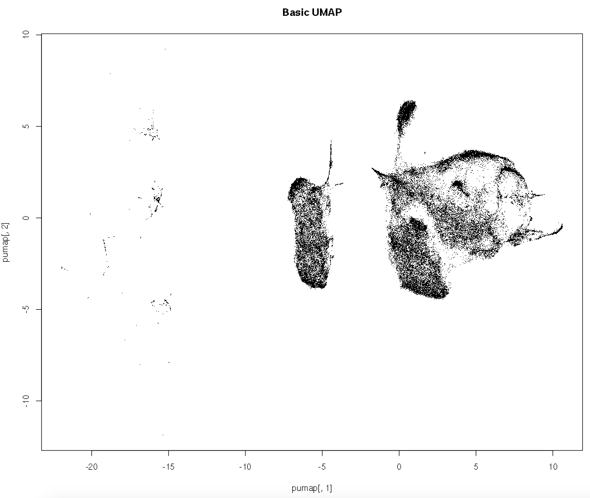
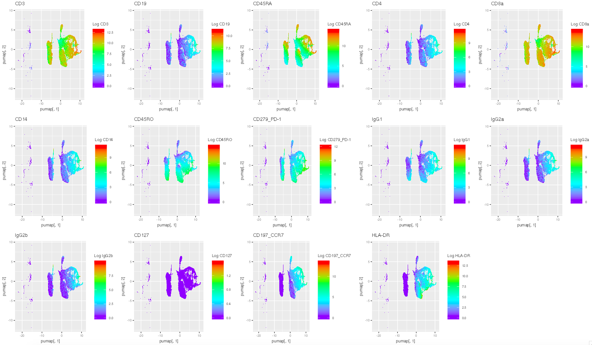
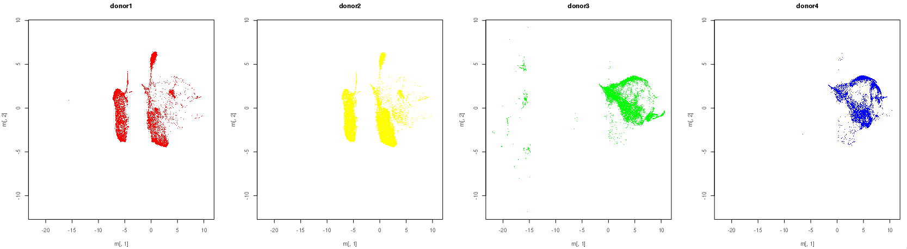
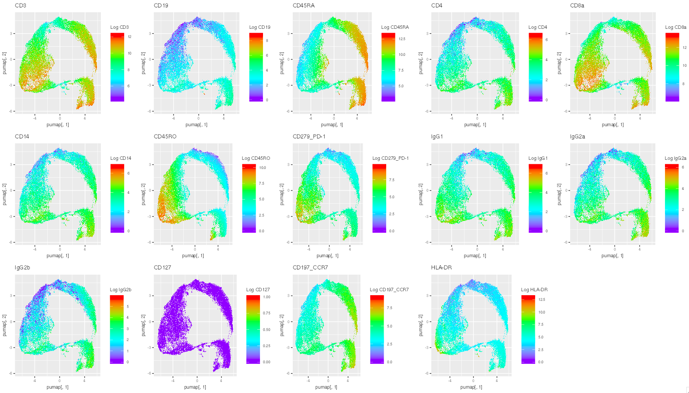
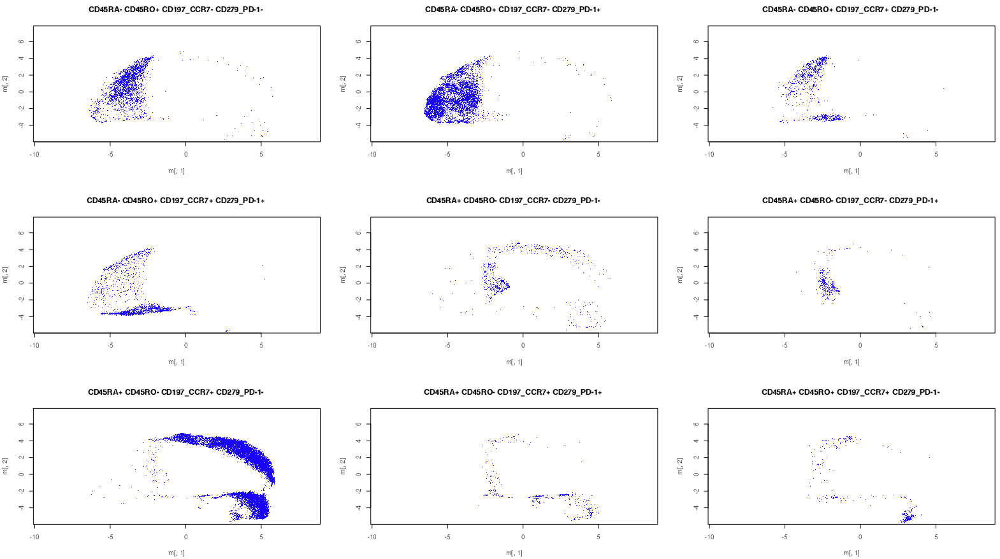

```{r setup, include=FALSE}
knitr::opts_chunk$set(echo = TRUE, eval = FALSE)
```

# FAUST annotation visualization project

## Introduction

I have been working with the 10X multi-omic CD8+ T-Cell data set for weeks now. This vignette encapsulates part II of my analysis of the data set. 

The data set draws around 50,000 CD8+ T-cells from each of four healthy donors, and for each cell measures both mRNA counts and cell-surface protein counts, among other things. One interesting question relates to how best to cluster this data and derive cell types. Traditional cluster approaches involve graphical dimension reduction (t-SNE or UMAP), followed with manual gating and analysis. FAUST, a newer approach, uses a non-parametric algorithm to cluster the data without reducing it to a lower dimensional representation. 

This vignette consists of me doing various analyses of the data to compare the two approaches.

### Faust

I have access to a FAUST annotation for the 10X cells, which clusters the cells into various sets of protein expression. The annotations have the following clusters:

FAUST annotation                        | Count
----------------------------------------|-----------------
0_0_0_0_0                               | 21959  
CD45RA- CD45RO+ CD197_CCR7- CD279_PD-1- | 50553  
CD45RA- CD45RO+ CD197_CCR7- CD279_PD-1+ | 49159  
CD45RA- CD45RO+ CD197_CCR7+ CD279_PD-1- | 6715  
CD45RA- CD45RO+ CD197_CCR7+ CD279_PD-1+ | 8681  
CD45RA+ CD45RO- CD197_CCR7- CD279_PD-1- | 26629  
CD45RA+ CD45RO- CD197_CCR7- CD279_PD-1+ | 4205  
CD45RA+ CD45RO- CD197_CCR7+ CD279_PD-1- | 36827  
CD45RA+ CD45RO- CD197_CCR7+ CD279_PD-1+ | 5887  
CD45RA+ CD45RO+ CD197_CCR7+ CD279_PD-1- | 1566  

0_0_0_0_0 represents cells which FAUST was unable to classify.

Notably: before entering FAUST, the data was cleaned using this function:

```{r clean, eval = FALSE}
feat.ctrl <- rownames(cite)[grep('IgG', rownames(cite))]
cite <- calculateQCMetrics(cite, feature_controls = list(IgG = feat.ctrl))
qc.igg <- isOutlier(cite$total_counts_IgG, nmads = 3, type = 'higher')
qc.cts <- isOutlier(cite$log10_total_counts, nmads = 3, type = 'lower')
keep <- !(qc.igg | qc.cts)
cite <- cite[, keep]
```

This function finds outliers with respect to IgG count or total count and removes them from the FAUST input.  
This function removes 25,829/237,883 of the cells, so the FAUST counts only add up to 212,054.  

## Reading Data

In this code segment we read in the various data and concatenate them into a single formatted SCE object.

```{r read}
# Sets up a single large sce object

library(BiocManager)
library(SingleCellExperiment)
library(DropletUtils)

sce <- read10xCounts("../10Xdata/vdj_v1_hs_aggregated_donor1_filtered_feature_bc_matrix.h5")
sce$Sample <- "donor1" # we overwrite the sample labels to be more readable
sce$color <- "red" # we give each donor a color for later visualization

sceTemp <- read10xCounts("../10Xdata/vdj_v1_hs_aggregated_donor2_filtered_feature_bc_matrix.h5")
sceTemp$Sample <- "donor2"
sceTemp$color <- "yellow"
sce <- cbind(sce, sceTemp) # bind the sce's together.

sceTemp <- read10xCounts("../10Xdata/vdj_v1_hs_aggregated_donor3_filtered_feature_bc_matrix.h5")
sceTemp$Sample <- "donor3"
sceTemp$color <- "green"
sce <- cbind(sce, sceTemp)

sceTemp <- read10xCounts("../10Xdata/vdj_v1_hs_aggregated_donor4_filtered_feature_bc_matrix.h5")
sceTemp$Sample <- "donor4"
sceTemp$color <- "blue"
sce <- cbind(sce, sceTemp)

data <- readRDS("../10Xdata/faustResults.rds")

# add the faust annotations to the sce
v <- data$faustAnnotation
names(v) <- data$barcode
# now that v is named with its own cell barcodes, we can reorder it and index it with the sce barcodes
v <- v[sce$Barcode]
v <- unname(v) # we don't need the names anymore (they're stored as the barcode in the sce already)
sce$faustAnnotation <- v

# cleans extra objects from memory
remove(sceTemp, data, v)
```

# Prepare Data

Now that we've read in our data, we can start preparing the sce data for clustering on the protein expression. This involves: subsetting the variables to just proteins, subsetting the cells to a desirable size, computing log counts, and other various bits and bobs.

```{r prepare}
library(scater)
library(purrr) #for piping

# first we subset the sce to just the protein observations
psce <- sce[grep("CD.*|IgG.*|HLA-DR", rowData(sce)$ID),]

size <- 50000 # subsetting makes the UMAP calculation faster, as well as the graphing
psce <- psce[,sample(1:ncol(psce), size)]
# now we compute log counts and store it
logcounts(psce) <- log2(1 + counts(psce))
# switching the logcounts from delayed matrix to matrix vastly speeds up later computations
logcounts(psce) <- as.matrix(logcounts(psce))
```

## UMAP

Now we can just grab the data from the sce and run a UMAP on it. We use uwot's umap function because it is faster than the R implementation that comes with umap itself.

``` {r basic}
library(uwot)
pumap <- psce %>%
  logcounts() %>%
  t() %>% # umap assumes that variables are columns and observations are rows, so we have to transpose
  uwot::umap(., verbose = TRUE) # this step can take a while to run, ~5 min
```

## Visualize

Now that we have our UMAP, we can take a look at various visualizations.

For each visualization, I will simply paste in graphs to avoid clutter. The code to generate the more complex graphs is attached at the end of the vignette.

We will start with a very simple graph, just putting all of the points down.

```{r graph}
plot(pumap[,1], pumap[,2], pch = '.', main = "Basic UMAP")
```

{width=500px}

We can already see that there is interesting structure in the right part of the plot. The left spattering of points are probably just outliers as a result from experimental error. We will look at these more later.

Here is the same UMAP, but colored based on each protein expression value.



There are two important things to see here.  
Firstly, regions of the UMAP do correlate with protein expression values. For example, in the third graph we see high CD45RA expression in the regions on the top right of the UMAP. This is to be expected, but it is a good sanity check.  
Secondly, we see a lot of points on the left with essentially no protein expression at all. If we get rid of those outlier cells, we will have a much nicer set to work with and perhaps our UMAP will look better. We can do our own outlier analysis and get rid of them, but we can also piggyback off of FAUST's cleaning for this step.

Here is the UMAP split by which donor each cell came from.



This is actually very interesting because it shows that there are strong batch effects across donors. Donors 1 and 2 were probably processed together, and donors 3 and 4. Donors 1 and 2 contributed more on the left half of the plot, while 3 and 4 more on the right. We can compare these regions with the protein UMAP above.

Notably, donors 1 and 2 generally lacked CCR7 readings, whereas donors 3 and 4 had higher readings. It would seem that something went wrong in the batch of donor 1 and 2 leading to a loss of CCR7 reads. Furthermore, donor 3 had many cells in the outlier region of the UMAP.

Based on these reasons, let's try using only cells from donor 4. There are only 36,619, so we don't need to downsample. Furthermore, we will remove the cells which were detected as outliers by the cleaning code at the top.

## Donor 4

```{r donor4}
psce <- sce[grep("CD.*|IgG.*|HLA-DR", rowData(sce)$ID), ]

# instead of sample, we simply select cells from donor 4
# we can find which cells are outliers as they will have NA as a FAUST annotation
psce <- psce[, psce$Sample == 'donor4']
psce <- psce[, !is.na(psce$faustAnnotation)]

logcounts(psce) <- log2(1 + counts(psce))
logcounts(psce) <- as.matrix(logcounts(psce))

pumap <- psce %>%
  logcounts() %>%
  t() %>%
  uwot::umap(., verbose = TRUE)
```



Now we have a cleaner UMAP to analyze. We see good separation of CD45RA (naive T-cells) and CD45RO (memory T-cells). We can pair that with this visualization of the FAUST annotations:



We can see that the UMAP has generally done a very good job separating out the different cell types. There is a clear region of effector memory RA cells in the middle of the graph around (-2, 0). However, some distinctions are very unclear from the UMAP. For example, the first two annotations, which are distinguised by PD-1 expression, occupy the same region of the UMAP. I think this is an advantage of FAUST, in that it can give clustering better than graph-based approaches.

# Supplemental Code
The code to draw the UMAP by protein expression:
```{r pplot}
pplot <- function(pNum) { # pNum is the row number of the protein we want to see
  # we will color cells according to their expression of the given protein
  ggplot(data.frame(pumap),  aes(pumap[,1], pumap[,2], colour = logcounts(psce)[pNum,])) +
    geom_point(stroke = 0, shape='.') +
    scale_colour_gradientn(colours = rev(rainbow(4)), name = paste("Log", rowData(psce)$ID[pNum])) +
    ggtitle(rowData(psce)$ID[pNum])
}

library(gridExtra)
# this just helps arrange all of the plots together
grid.arrange(grobs = lapply(1:dim(counts(psce))[1], pplot), nrow = 3)
```

The code to draw the UMAP by donor:
```{r dplot}
# first we want to grab good ranges on which to plot
# this will make the graphs easier to compare
xrange <- range(pumap[,1])
yrange <- range(pumap[,2])

dplot <- function(donor) {
  donorChar <- paste("donor", donor, sep = '')
  s <- psce$Sample == donorChar
  m <- pumap[s,]
  plot(m[,1], m[,2], xlim = xrange, ylim = yrange, main = donorChar, pch = '.', col = psce$color[s])
}

par(mfrow = c(1,4)) # 2,2 may be better to see detail
invisible(lapply(1:4, dplot)) # invisible removes the print output of lapply
```

The code to draw the UMAP by FAUST annotation:
```{r aPlot}
aplot <- function(num) { # num is the number of the annotation we want to see
  s <- !is.na(psce$faustAnnotation) & psce$faustAnnotation==names(tab[num])
  m <- pumap[s,]
  plot(m[,1], m[,2], xlim = xrange, ylim = yrange, main = names(tab[num]), pch = '.', col = psce$color[s])
}

tab <- table(sce$faustAnnotation)
par(mfrow = c(3,3))
invisible(lapply(2:dim(tab), aplot)) # we don't want to plot 0_0_0_0_0
```

