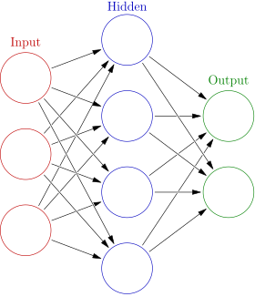

```{r setup, include=FALSE}
knitr::opts_chunk$set(echo = TRUE)
```

### Disclaimer

If you have worked with neural networks before, this will be quite rudimentary. Writing this section was primarily to cement my own understanding of these basic concepts, and to practice explaining them concisely. I go into much more interesting details in the vignette detailing my work and findings.

If you want a truly clean and thorough introduction, or just a good time learning some fascinating stuff, I highly recommend this amazing video series from 3Blue1Brown (https://www.youtube.com/watch?v=aircAruvnKk&list=PLZHQObOWTQDNU6R1_67000Dx_ZCJB-3pi).

## Goal of Deep Learning

**The broad goal of a neural network is to take an input list of numbers, transform it in complicated ways, and output a different list of numbers.** Usually the input represents some object you want to analyze, and the output is some calculated metric. For example, a simple neural network could perform addition. You give your network the list of numbers (5, 2, 3), and it outputs the sum of the numbers (10). On the opposite end, a complex neural network might, for example, take the color value for each pixel in a picture, and output a probability between 0 and 1 that the picture is of a golden retriever. These sound like impossibly different tasks, but both of them can be accomplished using a neural network.

## Layer Structure

Neural networks are made up of layers, each of which contains some number of nodes. The first layer is the input, where the first list of numbers goes, while the last layer is the output. Most networks have hidden layers in the middle, which help the network to calculate more complex functions. When running a neural network, input values enter in the first layer, and propagate layer-by-layer until they reach the last layer, the output.



## Edges

Each layer influences the layer that comes after it by connections called edges, each of which has a weighting generally between -1 and 1. In the diagram above, these are represented by the arrows.

Consider the example of the first two layers in the diagram. Let's say A is the input with 3 nodes and B is the hidden layer with 4 nodes. Thus we have nodes A1, A2, A3, and B1, B2, B3, and B4. There is one edge per pair of nodes between A and B, so for example, there is an edge between A2 and B1. In this example, we have 12 edges total (3 times 4), each of which has its own independent weight. Say the weighting between A2 and B1 is 0.75. Then when we are calculating the value of B1, we will add 0.75 times the value of A2. In this way, every value in layer A affects every value in layer B by virtue of its weighting.

## Training

**Training a neural network refers to an iterative process of tweaking the weightings to gradually improve performance.** When the network is initialized, generally it has nothing better to do than to randomly initialize all of the weightings. If we were to use an untrained neural network, the output would be no better than just guessing. However, we can use many different methods to slowly adjust the weightings, and eventually 'train' the neural net to do better than pure guessing. 

Training data refers to data for which we already know the output we want our network to produce. For example, if we have a picture we know is of a golden retriever, then this is perfect training data for our golden-retriever detecting network. Likewise, if we have a picture that we know is NOT of a golden-retriever, then that is valuable training data as well.

Using this training data, we can use a method called back-propagation to help our model do what we expect it to. Let's say we input our picture of a golden retriever, and get a probability of 40% that it was a golden retriever. Not bad, but we want to increase that number. We can use calculus to look backwards through our model and examine which weights we should increase or decrease to get a higher number.

If we train long enough, we eventually create a network that can identify complex patterns and extrapolate to inputs it has never seen.
